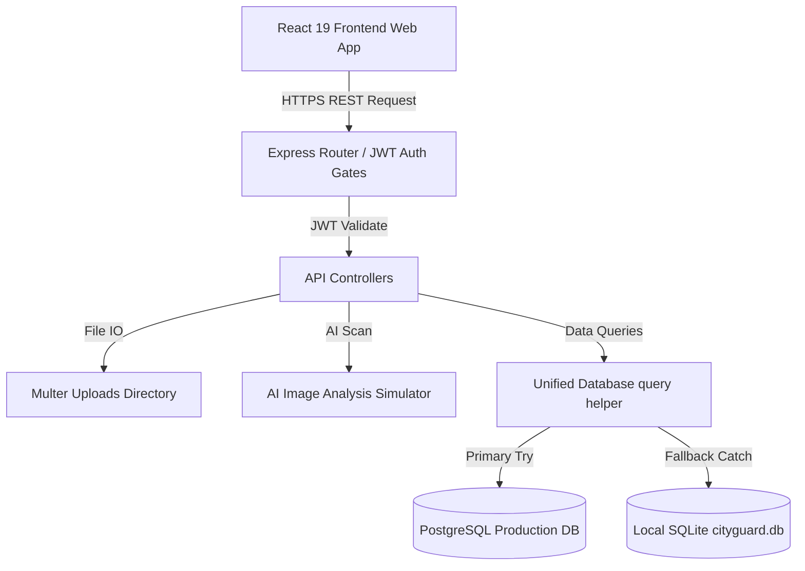

# CityGuard AI - Architectural Specifications

## Overview
CityGuard AI is built on a decoupled fullstack architecture consisting of a React 19 Client UI and a Node.js/Express.js Backend REST Service.

---

## 1. Frontend Architecture
The client application is scaffolded using **Vite + React 19** with styling based on **Tailwind CSS**.

### State Management
* **Auth Context**: Persists current session tokens, decrypted user roles, and toggles dark/light modes.
* **Axios Defaults**: Configured at application startup with base URL pointing to the server and intercepting headers automatically to append `Authorization: Bearer <token>`.

### GIS Integration
* **Leaflet Maps**: Custom wrapped in React `useEffect` hooks. This ensures zero React 19 hydration or version mismatch errors and enables rendering layers (Satellite, Street, Terrain) directly through DOM bindings.
* **Heatmap Overlay**: Soft semi-transparent circles color-coded by severity, rendering density indicators dynamically.

---

## 2. Backend Architecture
The backend is a **Node.js + Express.js** server.

### Modular Directories
* `server.js`: Standard express configuration, rate limiting, and global error middleware.
* `controllers/`: Direct request processing, data parsing, and JSON responders.
* `middleware/`: Authentication guards, custom role authorization gates, and Multer file validators.
* `utils/`: Reports generators (PDFKit, ExcelJS), system logging (logger.js), and the mock AI analysis precheck logic.

### Database Connection and Fallback Pattern
The database manager (`config/db.js`) exports a standard query interface:
1. Attempts connection to PostgreSQL using settings from `.env`.
2. On failure, catches the error and initializes a local SQLite file (`cityguard.db`).
3. Translates PostgreSQL query placeholders (`$1`, `$2`, etc.) dynamically into SQLite parameters (`?`).
4. SQLite runs schema creation and seeding automatically on first launch to ensure the application is immediately testable.
