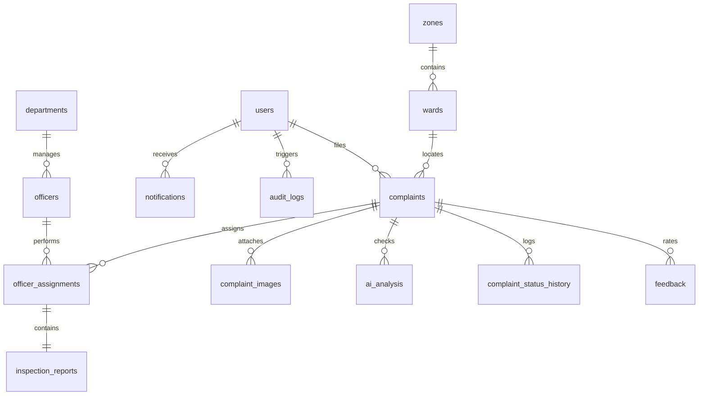

# CityGuard AI - Database Architecture

The schema is designed to support PostgreSQL (Production) and SQLite (Local Fallback) layouts.

## Entity Relationship Diagram

---

## Table Schemas

### 1. `users`
* Manages registration credentials, contact details, and platform access roles.
* **Fields**: `id` (PK), `email` (Unique), `password_hash`, `full_name`, `phone_number`, `role` (default: 'citizen'), `is_active` (default: true), `email_verified` (default: false), `otp`, `otp_expires_at`, `created_at`, `updated_at`, `deleted_at` (soft delete).
* **Indexes**: `idx_users_email` (B-Tree), `idx_users_role` (B-Tree).

### 2. `complaints`
* Stores registered violations details, landmarks, coordinates, and resolution states.
* **Fields**: `id` (PK), `complaint_number` (Unique), `citizen_id` (FK -> users), `description`, `address`, `latitude`, `longitude`, `ward_id` (FK -> wards), `category_id` (FK -> construction_categories), `custom_category`, `status` (default: 'pending'), `severity` (default: 'medium'), `nearby_landmark`, `created_at`, `updated_at`, `deleted_at`.
* **Indexes**: `idx_complaints_number`, `idx_complaints_status`, `idx_complaints_ward`.

### 3. `ai_analysis`
* Stores simulated predictive vision classifications.
* **Fields**: `id` (PK), `complaint_id` (FK -> complaints), `image_id` (FK -> complaint_images), `prediction_label`, `confidence_score`, `recommendation`, `raw_response`, `created_at`.

### 4. `inspection_reports`
* Stores physical check findings submitted by officers.
* **Fields**: `id` (PK), `assignment_id` (FK -> officer_assignments), `officer_id` (FK -> officers), `inspection_date`, `findings`, `recommendation`, `status_update`, `latitude`, `longitude`, `created_at`.
